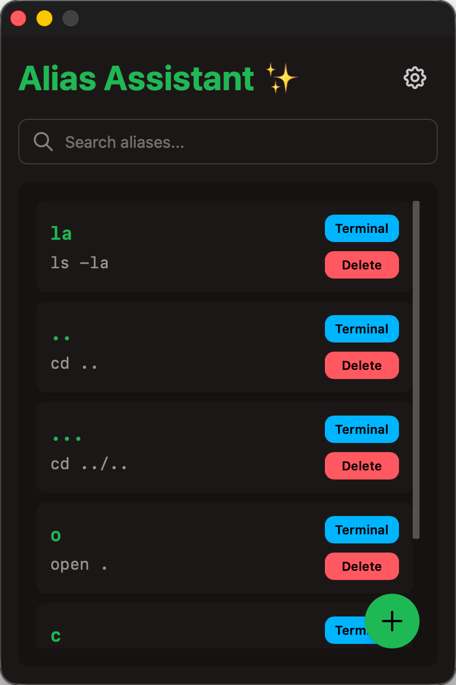

# Alias Assistant ✨

一个优雅的 shell 别名管理工具，使用 Tauri + Vue + TypeScript 构建。

<div align="center">
  
</div>

## 功能特性

- 🎯 **简洁的界面** - 使用 DaisyUI 和 Tailwind CSS 构建的现代化 UI
- 🔍 **快速搜索** - 实时搜索别名，快速找到你需要的命令
- 📋 **一键复制** - 点击 Terminal 按钮即可复制别名到剪贴板并打开新终端
- 🎨 **主题支持** - 内置多种主题，支持自动切换
- ⚡ **轻量快速** - 基于 Tauri，体积小、性能高
- 🔒 **安全可靠** - 本地存储，数据完全掌控

## 技术栈

- **前端**: Vue 3 + TypeScript + Vite
- **UI 框架**: Tailwind CSS 4 + DaisyUI 5
- **后端**: Rust + Tauri 2
- **包管理**: pnpm

## 开发

### 前置要求

- [Node.js](https://nodejs.org/) (推荐使用 LTS 版本)
- [pnpm](https://pnpm.io/)
- [Rust](https://www.rust-lang.org/) (Tauri 会自动安装，如需手动安装请参考 [Tauri 文档](https://tauri.app/zh-cn/v1/guides/getting-started/prerequisites))

### 安装依赖

```bash
pnpm install
```

### 开发模式

```bash
pnpm tauri dev
```

### 构建应用

```bash
# 构建所有平台的安装包
pnpm run tauri:build

# 仅构建 macOS App Bundle 和 DMG
pnpm run tauri:build:macos

# 仅构建 macOS App Bundle
pnpm run tauri:build:macos:app
```

## 版本管理

项目使用统一的版本号管理，版本号会自动同步到 `package.json`、`tauri.conf.json` 和 `Cargo.toml`。

### 更新版本号

```bash
# 更新补丁版本 (0.1.0 -> 0.1.1)
pnpm run version:patch

# 更新次版本 (0.1.0 -> 0.2.0)
pnpm run version:minor

# 更新主版本 (0.1.0 -> 1.0.0)
pnpm run version:major

# 手动同步版本号
pnpm run version:sync
```

## 项目结构

```
alias-assistant/
├── src/                    # Vue 前端代码
│   ├── App.vue            # 主应用组件
│   ├── main.ts            # 入口文件
│   └── index.css          # 全局样式
├── src-tauri/             # Tauri 后端代码
│   ├── src/
│   │   ├── main.rs        # Rust 入口
│   │   └── lib.rs         # 主要逻辑
│   ├── Cargo.toml         # Rust 依赖配置
│   └── tauri.conf.json    # Tauri 配置文件
├── scripts/               # 工具脚本
│   └── sync-version.js    # 版本号同步脚本
└── package.json           # Node.js 依赖配置
```

## 推荐 IDE 设置

- [VS Code](https://code.visualstudio.com/) + 以下扩展：
  - [Vue - Official](https://marketplace.visualstudio.com/items?itemName=Vue.volar)
  - [Tauri](https://marketplace.visualstudio.com/items?itemName=tauri-apps.tauri-vscode)
  - [rust-analyzer](https://marketplace.visualstudio.com/items?itemName=rust-lang.rust-analyzer)

## 许可证

MIT
