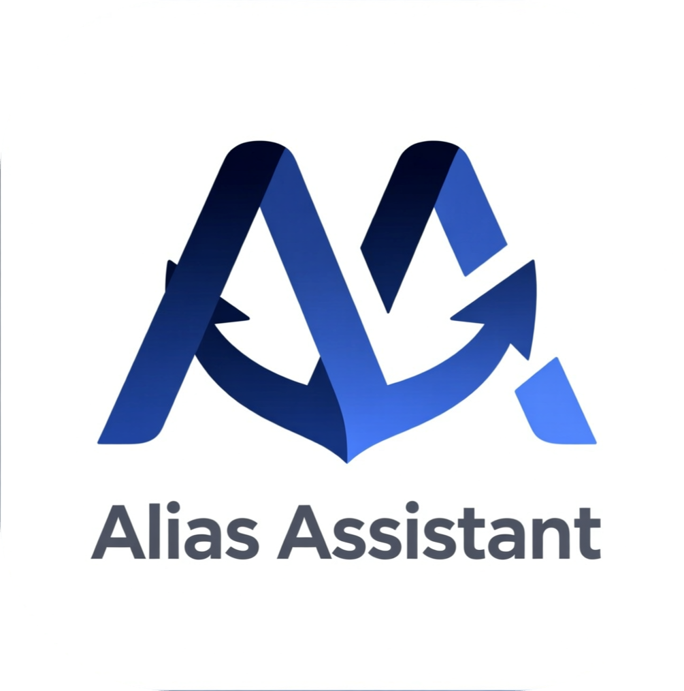
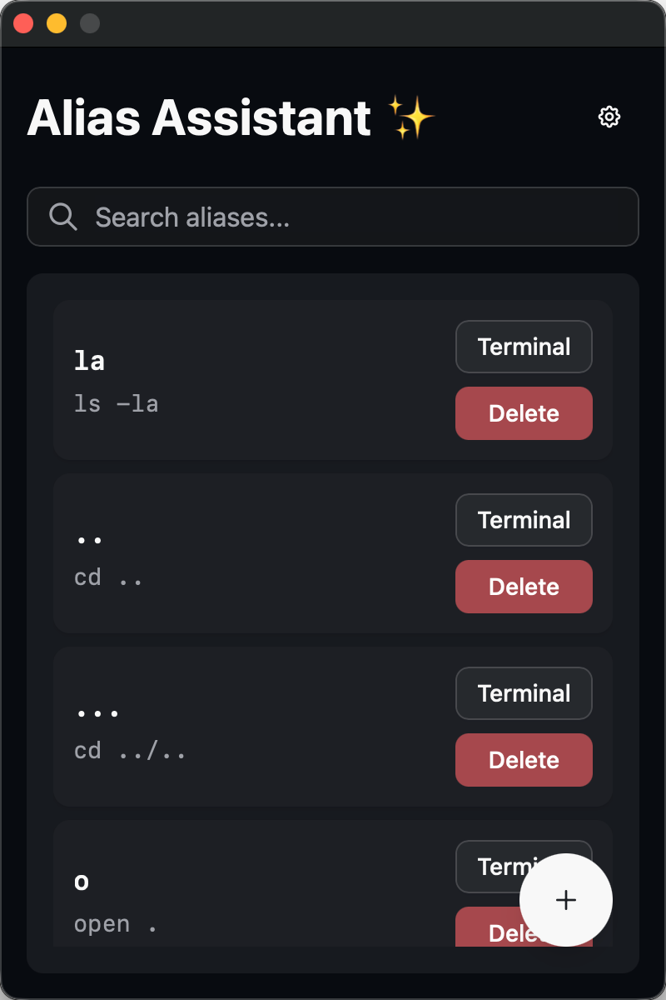
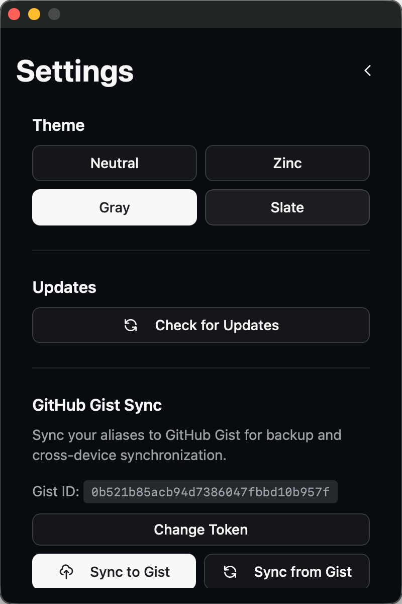

<div align="center">
  
  <h1>Alias Assistant✨</h1>
  <p>便捷的 macOS（Apple Silicon）shell 别名管理工具，使用 Tauri + Vue + TypeScript 构建。</p>
  
  
</div>

## 功能特性

- 🎯 **简洁界面** - 使用 Tailwind CSS 构建的现代化 UI
- 🖥️ **打开终端** - 点击 Terminal 按钮复制别名并打开新终端窗口
- 🔍 **快速搜索** - 实时搜索别名，快速找到你需要的命令
- 📋 **一键复制** - 点击列表项即可复制别名名称到剪贴板
- 💾 **导入导出** - 支持导入和导出别名文件，方便备份和迁移
- 🔒 **安全可靠** - 本地存储，数据完全掌控


## 使用说明

### 基本操作

1. **添加别名**：点击右下角的 "+" 按钮，输入别名名称和命令
2. **搜索别名**：在搜索栏输入关键词，实时过滤别名列表
3. **复制别名**：点击列表项任意位置，别名名称会自动复制到剪贴板
4. **打开终端**：点击 "Terminal" 按钮，会复制别名并打开新终端窗口
5. **删除别名**：点击 "Delete" 按钮，确认后删除别名

### 设置功能

点击右上角的设置按钮，可以：

- **切换主题**：选择 4 款内置主题之一，主题会自动保存
- **检查更新**：手动检查应用更新，如有新版本可一键安装
- **导出别名**：将当前所有别名导出为 `.sh` 文件
- **导入别名**：从 `.sh` 文件导入别名（同名别名会被替换）

### 常见问题

#### "Alias Assistant.app"已损坏，无法打开

```bash
# 清除文件的隔离属性
sudo xattr -c /Applications/Alias\ Assistant.app
```

## 文档

- [开发指南](docs/DEVELOPMENT.md) - 开发环境设置和项目结构
- [发布指南](docs/RELEASE.md) - 版本管理和发布流程

## 许可证

本项目采用 [MIT 许可证](LICENSE)。
